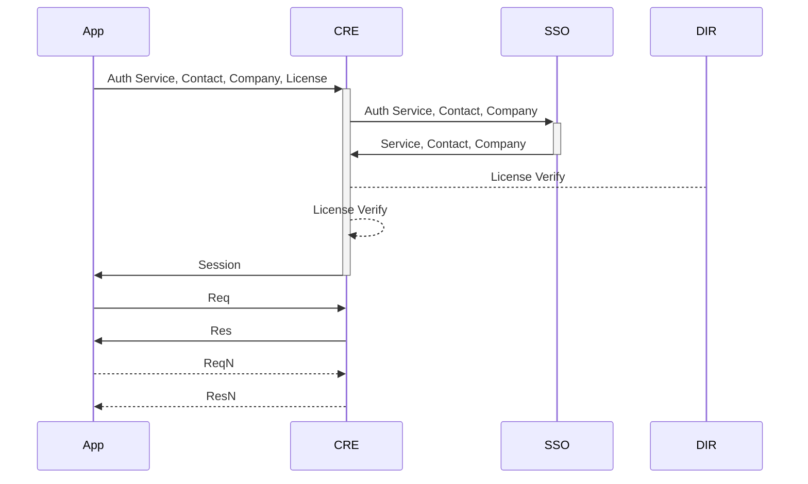

# Cannabis/Compliance/Crop Reporting Engine - CRE

This is a simple software solution for collecting and reporting on crops of cannabis or other tightly tracked, regulated products.
A simple setup of an event-object-audit-log database, along with the API end-point to collect the necessary details.

The platform is extendable by the regulatory agency/operating company through middleware.

More information is available at https://openthc.com/cre

## Global Storage

 * Company
 * License
 * Contact
 * Variety

### License Specific Data

 * Section (aka: Area, Room)
 * Inventory Lot
 * Crop
 * B2B Transaction (aka: Manifest, Invoice, Transfer)
 * B2C Transaction (aka: Retail, Dispense)

## Actions / Events

 * Crop/Create - Create Crops from Inventory Lot (of type: Plant, Clone or Seed)
 * Crop/Collect/Raw - Collect raw materials from the crop
 * Crop/Collect/Net - Account for net materials Dry/Cured/Trimmed state.
 * Crop/Collect/Lot - Creates Production Inventory Lot
 * Inventory/Create
 * Inventory/Convert - One or more Source Lots into one Output Lot
 * Inventory/Combine
 * Inventory/Sample - Remove a Small Portion for Unique Sample (Employee, QA, Vendor, etc)
 * B2B/Create - File the B2B Transaction
 * B2B/Commit - Commit/Send the B2B Transaction
 * B2B/Accept - Accept/Receive the B2B Transaction
 * B2B/Reject - Reject the B2B Transaction

## Reporting

 * Realtime Object States
 * Realtime Activity Reports
 * Verbose Logging with complete Object delta
 * Easily extendable via Middleware components

## APIs

 * Simple [API Interface](https://api.openthc.org/)
 * Direct Write/Update of Objects (Crop, Inventory, B2B, B2C)
 * Indirect Update via Actions

## Identifiers

 * ULID/UUID - https://github.com/ulid/spec
 * No reliance on central authority (*BioTrack*, *METRC*, *LeafData*)
 * No reliance on expensive RFID (*METRC*)
 * No "Smart" numbers (*BioTrack*, *LeafData*)
 * Support for billions of billions of tracked items
   * Usable until 10889 AD
   * 1.21 Giga-Giga (2^80) unique items per millisecond!

## Customizing

If you want to add new custom Services, Middleware or other code use the `./Custom` directory.
All of your custom libraries would be in `./Custom/Service` or `./Custom/Middleware`.
Then you can use them in the `./webroot/main.php` script.

## Authenitication

